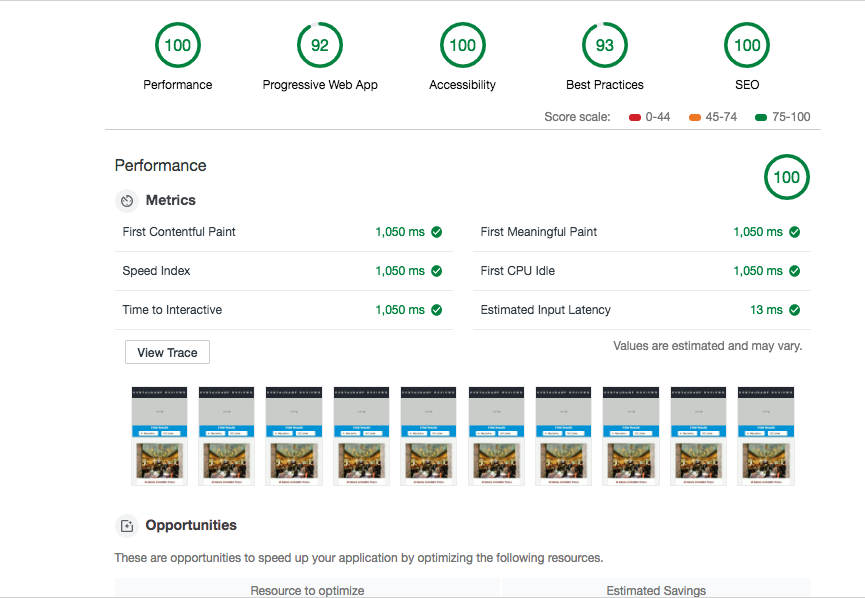

## My finished project from _Google_ and _Udacity_ Certification `Mobile Web Specialist`

This is a restaurant reviews's app

### Prerequisite

- Install the latest version of [`node.js`](https://nodejs.org/)
- Install [`git`](https://git-scm.com/)
- Install Chrome Canary navigator (important for the latest features and improvements of Lighthouse audits): `https://www.google.com/intl/fr_ALL/chrome/canary/`

### Running the project

#### Start the server

- Clone the server repo: `git clone https://github.com/udacity/mws-restaurant-stage-3.git`
- cd into the folder and run `npm install` then `node server` to start the server

#### Start the web app

- Clone the web app repo: `git clone https://github.com/fidele137/mws-restaurant-stage-1.git`
- cd into the folder and run `npm install`
- This project uses http2 which requires https. In order to enable localhost to be treated as secure, go to `chrome://flags` and enable `allow-insecure-localhost`
- Run `npm run start` to bootstrap the app
- Navigate to `https://localhost:/8443` and click `Proceed to localhost` in the `Advanced settings` to see the project

### To generate a new SSL certificate key

- Run `openssl req -x509 -newkey rsa:2048 -nodes -sha256 -subj '/CN=localhost' -keyout config/localhost-privkey.pem -out config/localhost-cert.pem`

### Lighthouse scores:

